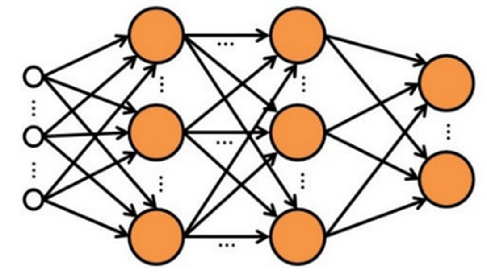
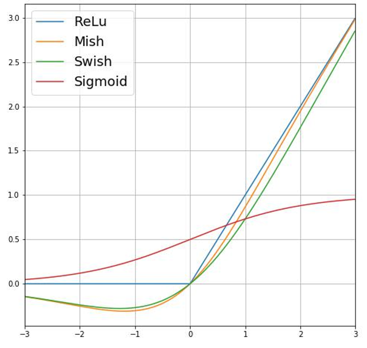
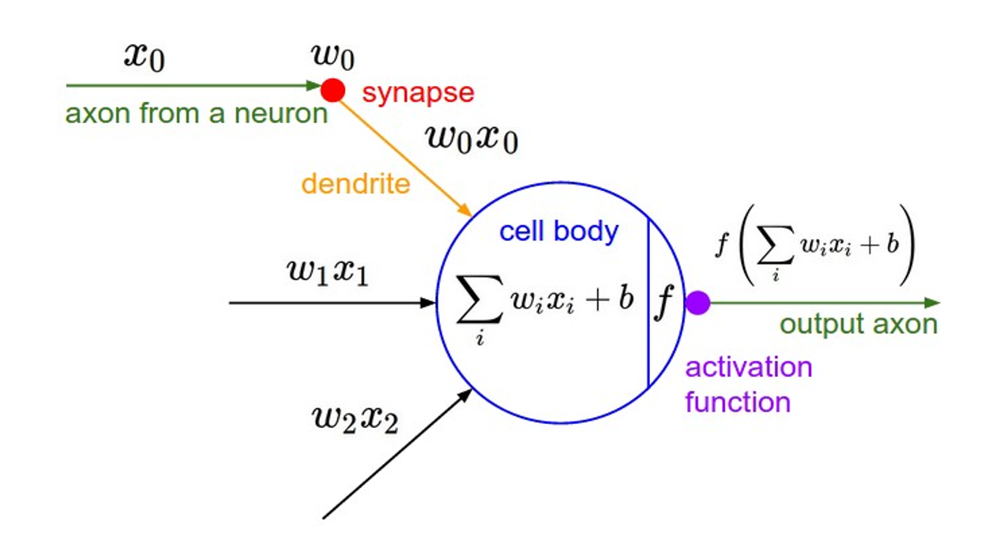

## What Deep Learning is?

<b>"Machine learning that involves using very complicated models called “deep neural networks”.".</b>

- It is a particular way of organizing a neural network, which can solve very difficult problems, like identifying faces from photos or videos and dealing with big data.​

- It is an advanced form of machine learning that tries to emulate the way the human brain learns.​​

- It emulates the biological process that happens in our brain using artificial neural networks to process numeric inputs rather than electrochemical stimuli.​

## Neurons and Neural Networks

## Neuron
​​
A Neuron is a mathematical function conceived as a model of biological neurons, a neural network.​

These neurons in turn may be activated and pass the signal on through the rest of the network. Over time, the connections between the neurons are strengthened by frequent use as you learn how to respond effectively. For example, if someone throws a ball towards you, your neuron connections enable you to process the visual information and coordinate your movements to catch the ball. If you perform this action repeatedly, the network of neurons involved in catching a ball will grow stronger as you learn how to be better at catching a ball.​

In our brain, we have nerve cells called neurons, which are connected to one another by nerve extensions that pass electrochemical signals through the network.​

When one neuron is stimulated, the input signal is processed, and if it exceeds a particular threshold, the neuron is activated and passes the signal on to the neurons to which it is connected. 

In the same way, An artificial neuron is a mathematical function conceived as a model of biological neurons, a neural network.​

So what does a neuron do?​

It takes the inputs and multiplies them by their weights,​
then it sums them up,​
after that it applies the activation function to the sum.​

So, till now, we got what neurons are, what neurons do, now we are left with a question, how do neurons learn?

For that, let’s see what neurons’ goal is.
The neuron’s goal is to adjust the weights based on lots of examples of inputs and outputs and determine.​
- which features are important and positive. ​
- which features are not important ​
- which features are important and negative .​

Neuron learns the weights based on the inputs and the desired outputs.​

## Neural Networks
Neural networks are the network of neurons having multiple layers.

It is also inspired by the network of neurons that operates in our brain.
For example, if we have one single neuron, it can perform a simple task. But of course, it might not be 100% accurate. So, we use a network of neurons. So, when an input is given, the neurons are activated, and pass the signal from layer to layer, finally providing the result. 
In this way, we are able to solve problems which are extremely difficult and also increase the accuracy.

Let’s see an example of a neural network. Here, we have four layers:-

- An input layer with a neuron for each expected input (x) value.​
- Two so-called hidden layers, each containing three neurons.​
- An output layer containing two neurons - one for each class probability (y) value to be predicted by the model.​
​
### Activation Function
Activation functions are mathematical equations that determine the output of a neural network.​

The function is attached to each neuron in the network and determines whether it should be activated or not, based on whether each neuron’s input is relevant for the model’s prediction.​
​
The output of the neuron is the output of the activation function.​

### Loss Function

A loss function or cost function is a function that maps an event or values of one or more variables onto a real number intuitively representing some "cost" associated with the event. An optimization problem seeks to minimize a loss function. ​
It tells us what is the loss we are getting while doing that event.

For example,Suppose one of the samples passed through the training process contains features of an Amelie specimen (class 0). 

The correct output from the network would be [1, 0, 0]. Now suppose that the output produced by the network is [0.4, 0.3, 0.3]. 

Comparing these, we can calculate an absolute variance for each element (in other words, how far is each predicted value away from what it should be) as [0.6, 0.3, 0.3].​

In reality, since we're actually dealing with multiple observations, we typically aggregate the variance - for example by squaring the individual variance values and calculating the mean, so we end up with a single, average loss value, like 0.16.​

### Artificial Neuron Representation

### Optimizers
So, we have seen that loss is calculated using a function, which operates on the results from the final layer of the network, which is also a function. The final layer of the network operates on the outputs from the previous layers, which are also functions. So in effect, the entire model from the input layer right through to the loss calculation is just one big nested function.
Optimizes are the functions that tie together the loss function and model parameters by updating the model in response to the output of the loss function

### Learning Rate
Now, let’s see what learning rate means.
- The amount that the weights are updated during training is referred to as the step size or the “learning rate.”​.​
- It is a hyperparameter that controls how much to change the model in response to the estimated error each time the model weights are updated. ​
- Choosing the learning rate is challenging as a value too small may result in a long training process that could get stuck, whereas a value too large may result in learning a sub-optimal set of weights too fast or an unstable training process.​
- The learning rate may be the most important hyperparameter when configuring your neural network. Therefore it is vital to know how to investigate the effects of the learning rate on model performance and to build an intuition about the dynamics of the learning rate on model behavior.​
### Overfitting and Underfitting
- Overfitting happens when a model learns the detail and noise in the training data to the extent that it negatively impacts the performance of the model on new data.​

- Underfitting refers to a model that can neither model the training data nor generalize to new data.​

So, we have seen the two worst cases. What should we do?

### Regularization
- Regularization is the process of adding information in order to solve an ill-posed problem or to prevent overfitting.​
- Regularization applies to objective functions in ill-posed optimization problems. ​
​
## Binary Classification
Binary classification refers to those classification tasks that have two class labels.

Binary classification tasks involve one class that is the normal state and another class that is the abnormal state.

Examples include:​
- Email spam detection (spam or not).​
- Churn prediction (churn or not).​
- Conversion prediction (buy or not).​
​
It is common to model a binary classification task with a model that predicts a Bernoulli probability distribution for each example.

## Linear Regression
Linear regression attempts to model the relationship between two variables by fitting a linear equation to observed data. One variable is considered to be an explanatory variable, and the other is considered to be a dependent variable. For example, a modeler might want to relate the weights of individuals to their heights using a linear regression model. 

Linear regression assumes that the relationship between your input and output is linear. It does not support anything else. This may be obvious, but it is good to remember when you have a lot of attributes. You may need to transform data to make the relationship linear (e.g. log transform for an exponential relationship).

#### Representation Used for Logistic Regression
Logistic regression is a statistical model that in its basic form uses a logistic function to model a binary dependent variable, although many more complex extensions exist. In regression analysis, logistic regression (or logit regression) is estimating the parameters of a logistic model (a form of binary regression). 

Logistic regression uses an equation as the representation, very much like linear regression.

Input values (x) are combined linearly using weights or coefficient values (referred to as the Greek capital letter Beta) to predict an output value (y). A key difference from linear regression is that the output value being modeled is a binary values (0 or 1) rather than a numeric value.

Below is an example logistic regression equation:

y = e^(b0 + b1*x) / (1 + e^(b0 + b1*x))

Where y is the predicted output, b0 is the bias or intercept term and b1 is the coefficient for the single input value (x). Each column in your input data has an associated b coefficient (a constant real value) that must be learned from your training data.
The actual representation of the model that you would store in memory or in a file are the coefficients in the equation (the beta value or b’s).
## Back Propagation
The true power of neural networks is their multilayer variant. Training single-layer perceptrons is straightforward, but the resulting network is not very powerful. The question became, How can we train networks that have multiple layers? This is where backpropagation came in.

Backpropagation is an algorithm for training neural networks that have many layers. It works in two phases. The first phase is the propagation of inputs through a neural network to the final layer (called feedforward). In the second phase, the algorithm computes an error, and then backpropagates this error (adjusting the weights) from the final layer to the first.

During training, intermediate layers of the network organize themselves to map portions of the input space to the output space. Backpropagation, through supervised learning, identifies an error in the input-to-output mapping, and then adjusts the weights accordingly (with a learning rate) to correct this error. Backpropagation continues to be an important aspect of neural network learning. With faster and cheaper computing resources, it continues to be applied to larger and denser networks.

## Training a deep neural network
The training process for a deep neural network consists of multiple iterations, called epochs. For the weight (w) and bias b values, the process is as follows:
- Features for data observations with known label values are submitted to the input layer.
- The neurons then apply their function, and if activated, pass the result onto the next layer until the output layer produces a prediction.
- The prediction is compared to the actual known value, and the amount of variance between the predicted and true values (which we call the loss) is calculated.
- Based on the results, revised values for the weights and bias values are calculated to reduce the loss, and these adjustments are backpropagated to the neurons in the network layers.
- The next epoch repeats the batch training forward pass with the revised weight and bias values, hopefully improving the accuracy of the model (by reducing the loss).

## Types of Neural Networks
### Artificial Neural Networks
- It is the most basic type of Deep Learning algorithms.
- It is designed to mimic processes in the human brain.
- They create a facility for a machine to learn instead of being hard-coded.
- It is also known as Vanilla Neural Nets
### Convolutional Neural Networks
- They were originally invented in the 80-90s for the character recognition on handwritten checks and envelopes.
- They are now used for processing of any kind of visual data from facial recognition to self-driving cars.
- It is also a branch of Supervised Learning.
### Recurring Neural Networks
- RNNs are the heavy-artillery of Supervised Networks.
- The idea is for NNs to have memory allowing them to process time series data and solve complex problems such as translation and video captioning.
- This is mostly possible due to a particular type of RNN called Long Short-Term Memory network.
### Boltzmann Machines
- It is a type of Unsupervised Neural Network.
- Extreme interconnectivity of neurons makes them powerful but computationally heavy.
- The simplified Restricted Boltzmann Machines are much faster and excel at feature detection making them a popular choice for recommender systems.

