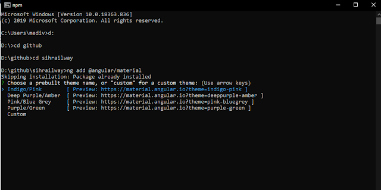
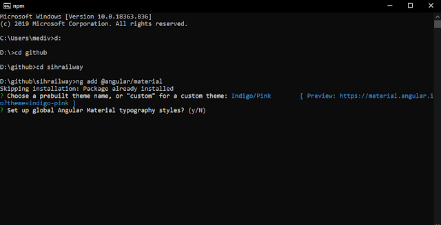

After spending my 5 months in the field of web development, I have got to know angular as a very user-friendly framework for creating Single Page Applications.

---

<a href="https://angular.io">
    <b>Angular</b>
</a> is a JavaScript MVC framework developed by
<a href="https://www.google.com">
    <b>Google</b>
</a> that lets you build well structured, easily testable, and maintainable front-end applications. Angular JS has evolved with time and even became better and now is known as Angular. It is written entirely again towards a new development workflow.

It wouldn't be wrong to say that if you have not tried Angular you are missing out on so much. This framework consists of a tightly integrated tool set that helps us to build mind blowing, rich client-side applications in a fashion with less code, and more flexibility.

---

## Setting up Angular environment for the First Time

In order to start making angular web apps, you need to have Node.js installed.

You can download a Node.js installer for your operating system from https://nodejs.org/en/download/.

Check the version of node.js installed using the command:

> ```bash
> node --version
> ```

Node.js installation gives you access to npm, using which we can install angular CLI.
Now to install Angular CLI globally we use.

> ```bash
> npm install -g @angular/cli
> ```

---

## Creating new angular app

Now to create a new angular app use command:

> ```bash
> ng new name-of-new-app
> ```

It will ask for adding routing in your project, which will create routing module in your project to navigate in your SPA.
Select Yes to add routing, else no.
Congratulations Woah, You've successfully created an angular app.

Now to see that running and ensure that you have successfully completed, go to root directory of the project use:
> ```bash
> cd name-of-new-app

> ng serve
> ```

And yeah you will see this basic page going on the address https://localhost:4200


---

## Angular Material

Angular material is the UI library built specifically for angular. It has many components which it provides by default.

## Adding Angular Material to the Project

For adding angular material to your library, use the command:-

> ```bash
> ng add @angular/material
> ```

After running this command, it will ask you to select from various themes. You can select anyone of these according to your choice.



 Then, it will ask whether to add angular typography.

 

Now, you have successfully setup the angular material in your project and you are ready to use the beautiful UI components provided by Angular Material.

### Adding navigation bar to your project

Angular material provides us side navigation bar from its library.
For adding navbar to your project, use:-

> ```bash
> ng add @angular/material:nav --name=navbar
> ```

Running this will create navigation bar component named navbar to your project.

---

These are the basics to get started with angular.

For knowing more about the components provided by Angular Material, checkout the website:- https://material.angular.io/

Thank you for reading, keep developing.