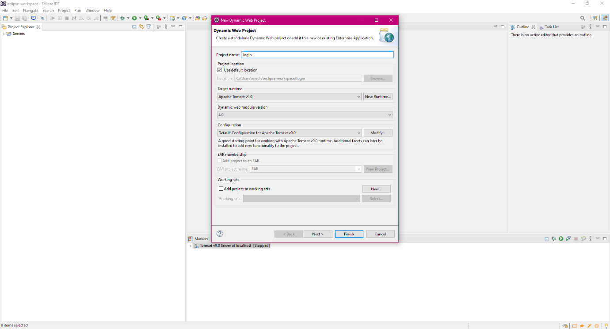
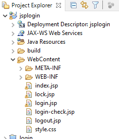
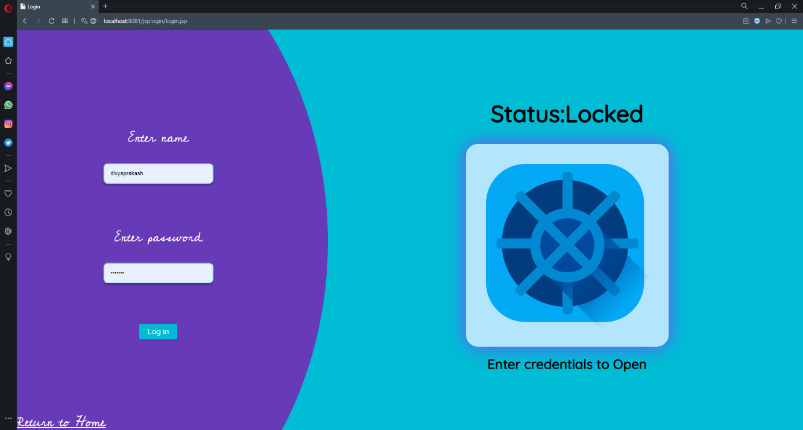
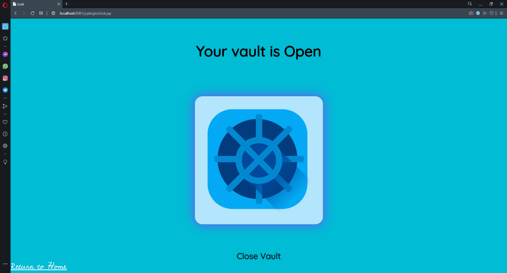
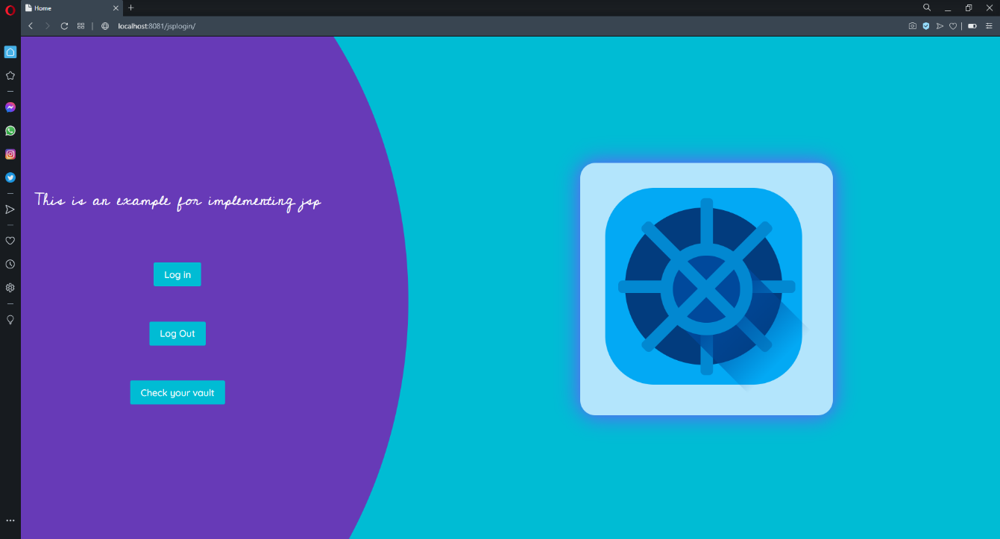
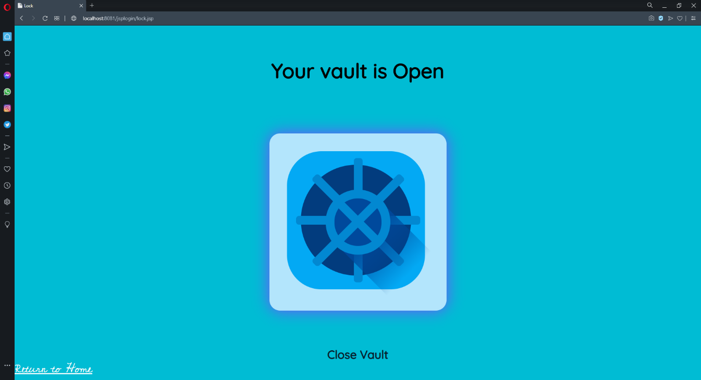
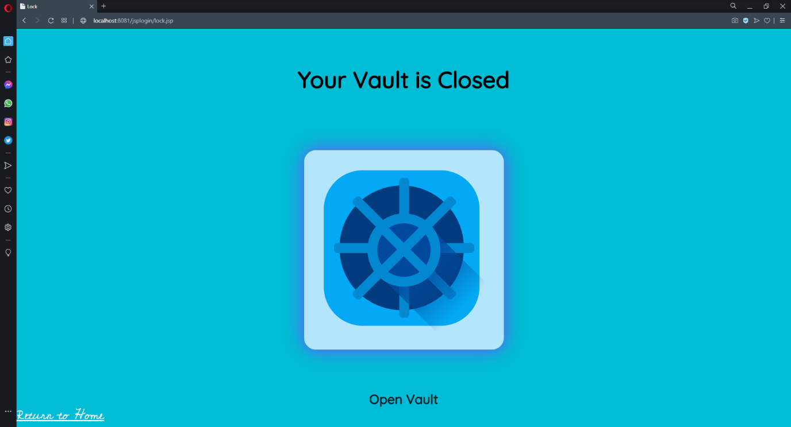
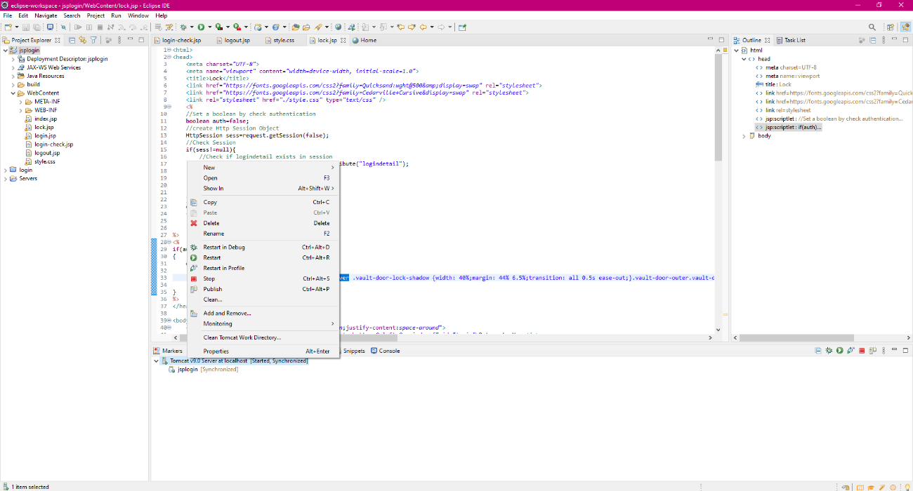

### Before diving deep, let us first give a look on what JSP is and what are its benefits?

> “JSP is a server side technology that does all the processing at server. It is used for creating dynamic web applications, using java as programming language.”

#### Benefits of JSP:-

Java Server Pages often serve the same purpose as programs implemented using the Common Gateway Interface (CGI). But JSP offers several advantages in comparison with the CGI. The advantages of JSP are as follows:

 - Performance is significantly better because JSP allows embedding Dynamic Elements in HTML Pages itself instead of having separate CGI files. 
 - JSP are always compiled before they are processed by the server unlike CGI/Perl which requires the server to load an interpreter and the target script each time the page is requested. 
 - JavaServer Pages are built on top of the Java Servlets API, so like Servlets, JSP also has access to all the powerful Enterprise Java APIs, including JDBC, JNDI, EJB, JAXP, etc. 
 - JSP pages can be used in combination with servlets that handle the business logic, the model supported by Java servlet template engines.

#### Alright, lets have a look on HttpSession:-

> “In web terminology, a session is simply the limited interval of time in which two systems communicate with each other. The session object is used to track a client session between client requests.”

JSP makes use of the servlet provided HttpSession Interface. This interface provides a way to identify a user across.

 - a one-page request or

 - visit to a website or

 - store information about that user

 - By default, JSPs have session tracking enabled and a new HttpSession object is instantiated for each new client automatically.The JSP engine exposes the HttpSession object to the JSP author through the implicit session object. Since the session object is already provided to the JSP programmer, the programmer can immediately begin storing and retrieving data from the object without any initialization or getSession().

 ---

 ## Setting up our project
 #### What we need as our setup?
 Nothing more, except these two :-

 - Eclipse IDE (Eclipse IDE for Enterprise Java Developers)

 - Apache Tomcat (for setting and starting up server)

Steps to create new project:-

1. Open Eclipse IDE.

2. Click on File -> New -> Dynamic Web Project. Following dialog box will appear.



3. We enter “jsplogin”(changeable) as our project name and select Apache Tomcat as our runtime.

4. Leaving all other settings to default and clicking on finish, we are ready with our project setup.

#### Folder Structure and files to edit:-

- For creating our project, our project needs some java files(for servlet), our webpages which will be served, and XML for servlet mapping and other informations.

- Our JSP files will be stored in a WebContent folder.

- After doing this, we will get our project directory something like this:-


#### Our files will be:-

1. index.jsp :- Homepage

2. login.jsp:- Login page

3. login-check.jsp:- Login validation and create session

4. lock.jsp:- Page which show current state of authentication

5. logout.jsp:- Logout page

6. style.css:- For Styling

---

#### Done with the setup part, we will proceed to coding:-

#### 1. index.jsp:- Homepage

>```jsp
><!DOCTYPE html>
><html lang="en">
><head>
>    <meta charset="UTF-8">
>    <meta name="viewport" content="width=device-width, initial-scale=1.0">
>    <title>Home</title>
>    <link href="https://fonts.googleapis.com/css2?family=Quicksand:wght@500&amp;display=swap" rel="stylesheet">
>    <link href="https://fonts.googleapis.com/css2?family=Cedarville+Cursive&display=swap" rel="stylesheet">
>    <link rel="stylesheet" href="./style.css" type="text/css" />
></head>
>
><body>
>    <div class="main">
>        <div class="sign-part">
>            <svg class="backimg" viewBox="0 0 828 1080" fill="none" xmlns="http://www.w3.org/2000/svg">
>                <ellipse cx="5.5" cy="565.5" rx="822.5" ry="954.5" fill="#673AB7" />
>            </svg>
>            <div class="sign-form">
>                <form class="sign-form">
>
>                    <div class="form-row">
>                        <span>
>                            <h1 id="topic">This is an example for implementing jsp</h1>
>                        </span>
>
>                    </div>
>                    <div class="form-row">
>                        <a class="signin-btn" href="login.jsp">Log in</a>
>                    </div>
>                    <div class="form-row">
>                        <a class="signin-btn" href="logout.jsp">Log Out</a>
>                    </div>
>                    <div class="form-row">
>                        <a class="signin-btn" href="lock.jsp">Check your vault</a>
>                    </div>
>                </form>
>            </div>
>        </div>
>        <div class="vault-part">
>            <div class="vault-door-outer">
>                <div class="vault-door-inner">
>                    <div class="vault-door-lock-shadow">
>                    </div>
>                    <div class="vault-door-lock-wrapper">
>                        <div class="vault-door-lock vault-door-circle">
>                        </div>
>                        <div class="vault-door-lock vault-door-pistons">
>                            <div class="piston piston1">
>                            </div>
>                            <div class="piston piston2">
>                            </div>
>                            <div class="piston piston3">
>                            </div>
>                            <div class="piston piston4">
>                            </div>
>                        </div>
>                    </div>
>                    <div class="vault-door-handle-shadow">
>                    </div>
>                    <div class="vault-door-handle-long-shadow">
>                    </div>
>                    <div class="vault-door-handle">
>                        <div class="handle-bar bar1">
>                        </div>
>                        <div class="handle-bar bar2">
>                        </div>
>                    </div>
>                </div>
>            </div>
>        </div>
>    </div>
></body>
></html>
>```

#### 2. login.jsp:- Login Page

> ```jsp
> <!DOCTYPE html>
> <html lang="en">
> 
> <head>
>     <meta charset="UTF-8">
>     <meta name="viewport" content="width=device-width, initial-scale=1.0">
>     <title>Login</title>
>     <link href="https://fonts.googleapis.com/css2?family=Quicksand:wght@500&amp;display=swap" rel="stylesheet">
>     <link href="https://fonts.googleapis.com/css2?family=Cedarville+Cursive&display=swap" rel="stylesheet">
>     <link rel="stylesheet" href="./style.css" type="text/css" />
> </head>
> 
> <body>
>     <div class="main">
>         <div class="sign-part">
>             <svg class="backimg" viewBox="0 0 828 1080" fill="none" xmlns="http://www.w3.org/2000/svg">
>                 <ellipse cx="5.5" cy="565.5" rx="822.5" ry="954.5" fill="#673AB7" />
>             </svg>
>             <a href="index.jsp" style="position: absolute;bottom:0;left:0;z-index:5" id="topic">Return to Home</a>
>             <form class="sign-form" action="login-check.jsp" method="post">
>                 <div class="form-row col">
>                     <label id="topic" for="name">Enter name</label>
>                     <input type="text" name="name" id="name" placeholder="Enter User Name">
>                 </div>
>                 <div class="form-row col">
>                     <label id="topic" for="name">Enter password</label>
>                     <input type="password" name="password" id="password" placeholder="Enter Password">
>                 </div>
>                 <div class="form-row">
>                     <button class="signin-btn" type="submit">Log in</button>
>                 </div>
>                 </form>
>             
>         </div>
>         <div class="vault-part">
>             <div class="status">
>                 <h1>
>                     Status:Locked
>                 </h1>
>             </div>
>             <div class="vault-door-outer">
>                 <div class="vault-door-inner">
>                     <div class="vault-door-lock-shadow">
>                     </div>
>                     <div class="vault-door-lock-wrapper">
>                         <div class="vault-door-lock vault-door-circle">
>                         </div>
>                         <div class="vault-door-lock vault-door-pistons">
>                             <div class="piston piston1">
>                             </div>
>                             <div class="piston piston2">
>                             </div>
>                             <div class="piston piston3">
>                             </div>
>                             <div class="piston piston4">
>                             </div>
>                         </div>
>                     </div>
>                     <div class="vault-door-handle-shadow">
>                     </div>
>                     <div class="vault-door-handle-long-shadow">
>                     </div>
>                     <div class="vault-door-handle">
>                         <div class="handle-bar bar1">
>                         </div>
>                         <div class="handle-bar bar2">
>                         </div>
>                     </div>
>                 </div>
>             </div>
>             <div class="msg">
>                 <h1>
>                     Enter credentials to Open
>                 </h1>
>             </div>
>         </div>
>     </div>
> </body>
> </html>
> ```

#### 3. login-check.jsp:-

Validates credentials and create Session.

> ```jsp
> <%  
> String name=request.getParameter("name");
> String password=request.getParameter("password");
> //Check credentials and if valid, set session attributes
> if(name.equals("divyaprakash") && password.equals("rangerx")){
> //Create HttpSession Object
>     HttpSession sess=request.getSession();
> 	//Set session attribute logindetail for authentication
>     session.setAttribute("logindetail", name+password);
> 	//Redirect to lock.jsp to view current status of vault
>     response.sendRedirect("lock.jsp");
> }else{
> 	//If credentials are wrong, prompt the user
>     out.print("<h4>Sorry, username or password is incorrect!</h4>");
>     getServletContext().getRequestDispatcher("/login.jsp").include(request, response);
> }
> %>
> ```

#### 4. lock.jsp:-

HTML to be sent when user checks his vault and he is authenticated.

> ```jsp
> <html>
> <head>
>     <meta charset="UTF-8">
>     <meta name="viewport" content="width=device-width, initial-scale=1.0">
>     <title>Lock</title>
>     <link href="https://fonts.googleapis.com/css2?family=Quicksand:wght@500&amp;display=swap" rel="stylesheet">
>     <link href="https://fonts.googleapis.com/css2?family=Cedarville+Cursive&display=swap" rel="stylesheet">
>     <link rel="stylesheet" href="./style.css" type="text/css" />
>     <%
>     //Set a boolean by check authentication
>     boolean auth=false;
>     //create HttpSession Object
>     HttpSession sess=request.getSession(false); 
>     //Check Session
>     if(sess!=null){
>         //Check if logindetail exists in session
>         String logindetail=(String)session.getAttribute("logindetail");
>         if(logindetail!=null){
>             //Set auth to true
>                 auth=true;
>                 }
>     }
>     else
>     {
>         //Set auth to False
>         auth=false;}
> %>
> <%
> if(auth)
> {
>     out.print(
>             "<style type=\"text/css\">"+
>             ".vault-door-outer.vault-door-outer:hover .vault-door-lock-shadow {width: 40%;margin: 44% 6.5%;transition: all 0.5s ease-out;}.vault-door-outer.vault-door-outer:hover .piston {width: 70%;margin-left: 14%;margin-right: 5%;transition: all 0.5s ease-out;}.vault-door-outer.vault-door-outer:hover .vault-door-handle {transform: rotate(-180deg);transition: all 1s ease-in-out;}</style>"
>             );
> }
> %>
> </head>
> 
> <body>
>     <div class="main" style="flex-direction: column;justify-content:space-around">
>         <a href="index.jsp" style="position: absolute;bottom:0;left:0;z-index:5" id="topic">Return to Home</a>
>         <div class="status">
>             <h1>
>               <% 
>               //if authorised, Show it is open else Close
>               if(auth)
>                   {
>                   out.print("Your vault is Open"); 
>                   }
>               else{
>                   out.print("Your Vault is Closed");
>               }
>               %>
>             </h1>
>         </div>
>         <div class="vault-door-outer active">
>             <div class="vault-door-inner">
>                 <div class="vault-door-lock-shadow">
>                 </div>
>                 <div class="vault-door-lock-wrapper">
>                     <div class="vault-door-lock vault-door-circle">
>                     </div>
>                     <div class="vault-door-lock vault-door-pistons">
>                         <div class="piston piston1">
>                         </div>
>                         <div class="piston piston2">
>                         </div>
>                         <div class="piston piston3">
>                         </div>
>                         <div class="piston piston4">
>                         </div>
>                     </div>
>                 </div>
>                 <div class="vault-door-handle-shadow">
>                 </div>
>                 <div class="vault-door-handle-long-shadow">
>                 </div>
>                 <div class="vault-door-handle">
>                     <div class="handle-bar bar1">
>                     </div>
>                     <div class="handle-bar bar2">
>                     </div>
>                 </div>
>             </div>
>         </div>
>         <div class="msg">
>         <% 
>             //if authorised, Provide option to Close Vault else Open Vault
>               if(auth)
>                   {
>                   out.print("<a href=\"logout.jsp\">Close Vault</a>"); 
>                   }
>               else{
>                   out.print("<a href=\"login.jsp\">Open Vault</a>");
>               }
>               %>
>         </div>
>     </div>
>     </div>
> </body>
> </html>
> ```

#### 5. logout.jsp:-

> ```jsp
> <%
> out.print("you are successfully logged out!");
> HttpSession sess=request.getSession(true);
> session.invalidate();  
> response.sendRedirect("index.jsp");
> %>
> ```

#### 6. style.css:-

> ```css
> body,
> html {
>   background-color: #00bcd4;
>   width: 100vw;
>   max-width: 99vw;
>   margin: 0;
>   padding: 0;
>   overflow-x: hidden;
>   font-family: "Quicksand", sans-serif;
> }
> .main {
>   width: 100vw;
>   min-height: 100vh;
>   display: flex;
>   justify-content: center;
>   align-items: center;
>   overflow:hidden;
>   flex-wrap: wrap;
> }
> 
> .sign-part {
>   width: 40%;
>   display: flex;
>   height: 100vh;
> }
> .backimg {
>   height: 100%;
>   width: auto;
>   position: absolute;
>   z-index: 0;
> }
> .sign-form {
>   height: 100%;
>   z-index: 3;
>   width: 100%;
>   display: flex;
>   flex-direction: column;
>   align-items: center;
>   justify-content: center;
>   padding-right: 4vw;
> }
> input {
>   background-color: #cbefff;
>   box-shadow: 0px 4px 4px rgba(0, 0, 0, 0.25);
>   border-radius: 10px;
>   color: #08202c;
>   border-color: #b3e5fc;
>   min-width: 100%;
>   padding: 15px;
>   margin: 30px;
> }
> #topic {
>   font-family: "Cedarville Cursive", cursive;
>   font-weight: 300;
>   font-size: 2rem;
>   color: #ffffff;
> }
> .form-row {
>   margin-top: 5%;
>   margin-bottom: 5%;
>   display: flex;
> }
> .col {
>   flex-direction: column;
> }
> .vault-part {
>   width: 60%;
>   display: flex;
>   justify-content: center;
>   align-items: center;
>   flex-direction: column;
> }
> .signin-btn {
>   background: none;
>   border: none;
>   height: 36px;
>   width: 100%;
>   display: -ms-flexbox;
>   display: box;
>   display: flex;
>   font-family: "Quicksand";
>   -o-box-align: center;
>   -ms-flex-align: center;
>   align-items: center;
>   border-radius: 3px;
>   background-color: #00bcd4;
>   font-size: 18px;
>   padding: 5px 20px 5px 20px;
>   cursor: default;
>   color: #ffffff;
>   text-decoration: none;
> }
> .signin-btn:hover {
>   background-color: #023c7e;
>   transition: all 0.5s;
> }
> .form-row {
>   display: flex;
>   align-items: center;
>   justify-content: center;
> }
> 
> .status > h1 {
>   font-size: 3.5rem;
> }
> .msg > a {
>   color: #08202c;
>   text-decoration: none;
>   font-size: 2rem;
>   font-weight: bold;
> }
> 
> @media (max-width: 768px) {
>   .sign-part,
>   .vault-part {
>     width: 100%;
>   }
>   .sign-part {
>     height: 40vh;
>     margin: 0;
>     padding: 0%;
>   }
>   .sign-part > .backimg {
>     -webkit-transform: rotate(90deg);
>     -moz-transform: rotate(90deg);
>     -o-transform: rotate(90deg);
>     writing-mode: tb-rl;
>     -ms-writing-mode: bt-rl;
>     height: 130vw;
>     margin-top: -20vh;
>   }
> }
> /* Vault part*/
> .vault-door-outer {
>   position: relative;
>   width: 50vh;
>   height: 50vh;
>   background: #b3e5fc;
>   border-radius: 6%;
>   box-shadow: 0px 0px 41px #7c4dff;
> }
> .vault-door-outer .vault-door-inner {
>   position: absolute;
>   margin: 10%;
>   width: 78%;
>   height: 78%;
>   background: #03a9f4;
>   border-radius: 25%;
> }
> .vault-door-outer .vault-door-inner .vault-door-lock-shadow {
>   position: absolute;
>   width: 68%;
>   height: 36%;
>   background: -webkit-linear-gradient(rgba(160, 160, 160, 0.2), transparent);
>   margin: 34% 18%;
>   transform: rotate(-45deg);
>   transition: all 0.05s ease-out;
> }
> .vault-door-outer .vault-door-inner .vault-door-lock {
>   background: #023c7e;
> }
> .vault-door-outer .vault-door-inner .vault-door-circle {
>   position: absolute;
>   width: 80%;
>   height: 80%;
>   margin: 10%;
>   border-radius: 50%;
> }
> .vault-door-outer .vault-door-inner .vault-door-pistons {
>   position: absolute;
>   width: 90%;
>   height: 90%;
>   margin: 47% 6.5%;
>   background: none;
> }
> .vault-door-outer .vault-door-inner .vault-door-pistons .piston {
>   position: absolute;
>   background: #0288d1;
>   width: 100%;
>   height: 7%;
>   border-radius: 8px;
>   transition: all 0.05s ease-out;
> }
> .vault-door-outer .vault-door-inner .vault-door-pistons .piston.piston2 {
>   transform: rotate(45deg);
> }
> .vault-door-outer .vault-door-inner .vault-door-pistons .piston.piston3 {
>   transform: rotate(90deg);
> }
> .vault-door-outer .vault-door-inner .vault-door-pistons .piston.piston4 {
>   transform: rotate(135deg);
> }
> .vault-door-outer .vault-door-inner .vault-door-handle-shadow {
>   position: absolute;
>   background: #00499c;
>   width: 40%;
>   height: 40%;
>   margin: 32%;
>   border-radius: 50%;
> }
> .vault-door-outer .vault-door-inner .vault-door-handle-long-shadow {
>   position: absolute;
>   background: -webkit-linear-gradient(#00499c, transparent);
>   width: 45%;
>   height: 45%;
>   margin: 50%;
>   transform: rotate(-45deg);
> }
> .vault-door-outer .vault-door-inner .vault-door-handle {
>   position: absolute;
>   border: solid 2.5vh #0288d1;
>   width: 34%;
>   height: 34%;
>   margin: 28%;
>   border-radius: 50%;
>   transition: all 0.3s ease-in-out;
> }
> .vault-door-outer .vault-door-inner .vault-door-handle .handle-bar {
>   position: absolute;
>   background: #0288d1;
>   height: 18%;
>   width: 115%;
>   margin: 40% -8%;
> }
> .vault-door-outer .vault-door-inner .vault-door-handle .handle-bar.bar1 {
>   transform: rotate(45deg);
> }
> .vault-door-outer .vault-door-inner .vault-door-handle .handle-bar.bar2 {
>   transform: rotate(135deg);
> }
> .vault-door-outer.vault-door-outer:hover .vault-door-lock-shadow {
>   width: 40%;
>   margin: 44% 6.5%;
>   transition: all 0.5s ease-out;
> }
> .vault-door-outer.vault-door-outer:hover .piston {
>   width: 88%;
>   margin-left: 5%;
>   margin-right: 5%;
>   transition: all 0.5s ease-out;
> }
> .vault-door-outer.vault-door-outer:hover .vault-door-handle {
>   transform: rotate(-180deg);
>   transition: all 1s ease-in-out;
> }
> 
> /* Vault Part end */
> ```

---

### Running our Project

Done with all the coding, now its time to check our code running:-

To run the project in eclipse IDE we follow these steps:-

1. Select your project by clicked on its name directory in projects panel.

2. Click on Run -> Run as -> Run on Server.

3. Here, we will select Tomcat server, then click on next.


4. Here, our project will already be added in configured state, we can do this, if not done so by clicking on button.


5. Click on Finish.

Our project will now being served on the localhost server on defined port ( by default 8080).

### Exploring our Project in web browser

1. Open any web browser and hit to url http://localhost:8080/jsplogin.We can see our homepage (index.html) is served.


2. We can check the current status of the vault by clicking on “Check your vault” button. We can see it shows vault in locked state.

3. Click on return to home and then click on “Log In” button. Here we will enter our username (divyaprakash) and password (rangerx) to open our vault, which if we enter incorrect prompts us to enter correct one.

4. After providing right credentials, we are served page in which vault is open.

5. The vault will be open for the time until we close the vault or log out, which we can verify by returning to home and again checking the current vault state.


6. Now, if we log out or close our vault, our vault state changes to close state until we again log in.

7. As our all steps are complete, we can switch off our server by navigating to Window -> Show View -> Servers. Here right click on running server and click on stop.


---

#### In this way, we have successfully implemented login and logout with the help of JSP.