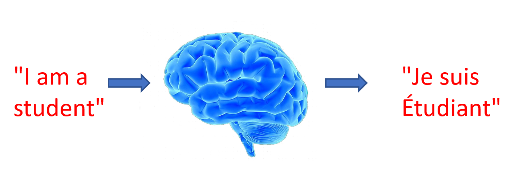

Can u imagine a world without google assistant or siri, tough right?

In the world in which we are living is full of the application of artificial intelligence. From Alexa to siri, automatic suggestions, google assistant, recommendations etc, all are possible due to Artificial Intelligence. 

---

### “About 100 years ago, electricity transformed every major industry. AI has advanced to the point where it has the power to transform...every major sector in coming years.”

## What is AI?
 > AI is the study of how to make computers perform tasks that humans consider difficult through the creation of intelligent agents. The study of AI began in the 1950s, and it has improved dramatically over time with better statistical methods and greater computing power.​

AI is now used for all sorts of things, such as intelligent opponents in video games, accurate medical diagnosis, speech commands on mobile phones, and keeping email inboxes clear of spam. People who use AI often want it to perform repetitive tasks that take a lot of time for a person to do, or to solve problems which seem almost impossible to solve with a calculator.
We can simply say that, it’s a brain created by biological brains to perform better than the normal brain and reach the places which are hard to reach by human brains.
It reduces our time, expands our reach, make our world easier and behaves as a partner.

## AI Breakthroughs

AI has seen a lot of improvements. Let’s have a look on those:-

In <b>1997</b>, IBM’s chess supercomputer defeated world class champion Garry without using the techniques that could be considered true AI by today’s standards.

In <b>2011</b>, Cognitive Computing Engine played against champion players of the TV game show Jeopardy, defeated them and claimed a $1 million prize.

By <b>2012</b>, Computers were capable of identifying cats and dogs.

By <b>2016</b>, AlphaGo,created by DeepMined defeated world Go champion Lee Sedol over five matches.

By <b>2018</b>, we have self-driving cars on our roads.

## AI, ML and DL
Let’s see how AI, ML and DL are related.

- <b>Machine Learning</b> or ML is a subset of AI. It refers to the study and construction of programs that are not explicitly programmed but learn patterns as they are exposed to more data over time.

- <b>Deep Learning</b> is the subset of ML in which multi-layered neural networks learn from vast amounts of data.

So, what did we get?
We have AI as the superset of ML, and ML as the superset of DL.

## Applications of AI 

- We all do shopping online and in the malls, right? After shopping, when we revisit the shopping app, we have some suggestions. Had anyone noticed that? Yup, they are similar to the product we have purchased. What’s the whole scene going behind it? Actually, the AI models give predictions based on previous purchases and it seems like wow.
  In biology, if we have a microscopic picture, it’s a difficult task for us to count  the no. of cells, but not if we use AI there.
- Count cells in a microscope picture
- Find the optimum number of taxis that a city needs
- If we take two different cities, both will have different needs. For example, if we want to know how much taxis a city needs so that there would not be a shortage. This will depend on a no. of features such as no. of people, tracks, the traffic, distance of workplaces etc. And we also have to think how much percentage these all features should affect? A pretty hard task, right? Here, we use AI.
Suppose we have an image, and it is blur and it’s the image of a car accident and the police wants to read the license plate. Even James Bond can’t read that. Wait, but our AI can.

- One last example, suppose we have a set of images and you want to classify them on a certain basis, and the no. is in millions, how can anyone do that. It is done by AI.

