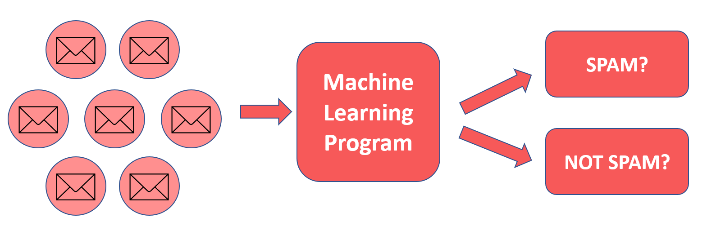
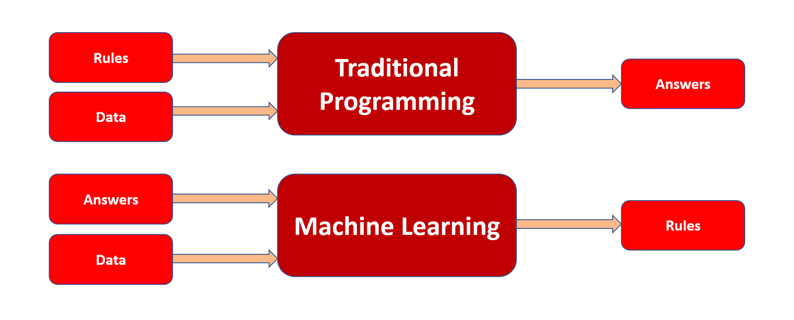

## What Machine Learning is?

These are the programs that learn from repeatedly analyzing data, rather than explicitly programmed by humans.

For example, suppose we have a no. of mails, and we want to separate them as spam or not spam. What will we do?
Or by other way, Here we are seeing that we have a no. of mails and a machine learning program classifying them as spam or not spam.
So, what’s the scene going all over there? 

Alright, let’s see what’s that?

We have algorithms, we used it to create a model that is capable of deciding whether a mail is a span or not, integrated that model to a machine learning program, and that’s it!
Our machine learning program applies that algorithm to all the mail and classifies them as spam or not spam.

## Difference between Traditional Programming and Machine Learning

The difference between Traditional Programming and Machine Learning is:-

- In Traditional Programming, we feed rules and data, and in result, we get answers.
- In Machine learning, we feed data and answers, and in result, we get rules.

## Different types of machine learning

### Supervised Machine Learning

Supervised learning is a learning in which we teach or train the machine using data which is well labeled that means some data is already tagged with the correct answer.​

As the name suggests, supervised machine learning refers to the learning in which we teach the model to determine the correct answer. 

We can understand this as, Suppose we have a set X containing all the inputs(for example images), and a finite set of elements Y containing all the outputs(for example the classifications). So, here we are telling our model that hey, you have to match the input data to the output I provided you. And it thinks, Oh wow, means I know what I have to do,that’s easy for me.

Let’s make it more simpler with an example.Suppose, we have a collection of images of animals i.e. our dataset, and one another set containing the types of all the animals e.g. dogs, cats etc.
So, here our model knows that it has to map the inputs i.e. images in dataset, to the output types i.e. types of animals.

So, some important points, which we drive from here are:-
- In supervised learning, We have a target column.
- It is easier than other types of machine learning.
- We have regression and classification as types of machine learning.

### Unsupervised Machine Learning
Unsupervised learning is the learning where only the input data is present, and no corresponding output variable is there.

In Unsupervised machine learning, observations are grouped into clusters based on similarities in their data values, or features. This kind of machine learning is considered unsupervised because it does not make use of previously known label values to train a model;
For example, in a clustering model, the label is the cluster to which the observation is assigned, based purely on its features.​

For example, suppose a botanist observes a sample of flowers and records the number of petals and leaves on each flower.​

Now he wants to separate all the flowers based on his features. He knows it is difficult and he also knows that using unsupervised learning, his work will be easier.

Let’s see what he does.
​
- He vectorizes the feature values to create n-dimensional coordinates (where n is the number of features). Here, he has two features (number of petals and number of leaves), so the feature vector has two coordinates that he uses to conceptually plot the data points in two-dimensional space.​
- He decides how many clusters you want to use to group the flowers, and call this value k. For example, to create three clusters, he uses a k value of 3. Then k points are plotted at random coordinates. These points will ultimately be the center points for each cluster, so they are referred to as centroids.​
- He assigns each data point (in this case flower) to its nearest centroid.​
- He moves each centroid to the center of the data points assigned to it based on the mean distance between the points.​
- After moving the centroid, the data points may now be closer to a different centroid, so the data points are reassigned to clusters based on the new closest centroid.​
- He repeats the centroid movement and cluster reallocation steps until the clusters become stable or a predetermined maximum number of iterations is reached.​

### Reinforcement Machine Learning

Reinforcement Learning is the branch of machine learning that permits systems to learn from the outcomes of their own decisions. It solves a particular kind of problem where decision making is sequential, and the goal is long-term.​

It means in reinforcement learning, the machine learning program takes the decisions, and then it sees what were its outcomes and then learns from its outcomes, and improves its efficiency more and more.

## Common terms in Machine Learning
 - <b>Model</b>:-  A computation or a formula formed as a result of mathematical algorithm, which when fed some data and human expert input, replicates the same decision as a human expert would have made when provided the same information.​
 

 - <b>Fitting</b>:- Model fitting refers to the process of training a model of  how well it replicates the original results of the data/input fed into it or some similar data/input.​
 

 - <b>Training</b>:- A process through which a model learns about the weights and bias of the data/input fed to it, that is, how much the outcome depends on a given feature of the input/data fed into it.​
 

 - <b>Testing</b>:- A process through which a model is generalized for a given prediction by checking it against some unknown & random data/input. The testing data should be chosen carefully.​

 - <b>Weight</b>:- It is used to strengthen or weaken the effect of the x value to simulate learning.

 - <b>bias</b>:- It is added to enable fine-grained control over the network.

